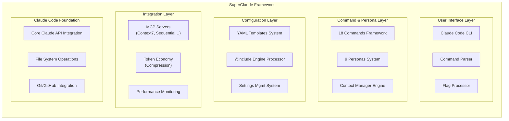

# SuperClaude Architecture Documentation

**Version:** 2.0.1  
**Status:** Phase 1 - Foundation Documentation  
**Last Updated:** 2025-07-13  
**Branch Strategy:** `latest` (main development) | `master` (original preserved)

---

## Table of Contents

- [Overview](#overview)
- [Phase 1: Foundation Architecture](#phase-1-foundation-architecture)
- [System Architecture](#system-architecture)
- [Core Components](#core-components)
- [Configuration System](#configuration-system)
- [Command Framework](#command-framework)
- [Persona System](#persona-system)
- [MCP Integration](#mcp-integration)
- [Token Economy](#token-economy)
- [Data Flow](#data-flow)
- [Security Architecture](#security-architecture)
- [Development Phases](#development-phases)
- [TODO: Phase 2+ Planning](#todo-phase-2-planning)

---

## Overview

SuperClaude is a sophisticated configuration framework that enhances Claude Code with specialized commands, cognitive personas, and advanced development methodologies. It transforms the standard Claude Code experience into a comprehensive development environment optimized for professional workflows.

### 🎯 **Core Philosophy**
- **Evidence-Based Development**: All decisions backed by testing and documentation
- **Token Efficiency**: UltraCompressed mode providing 70% token reduction
- **Cognitive Diversity**: 9 specialized personas for domain-specific approaches
- **Professional Standards**: Enterprise-grade configuration and workflow management

### 🏗️ **Architecture Principles**
- **Modular Design**: Component-based architecture enabling independent development
- **Configuration-Driven**: YAML-based configuration system with @include references
- **Extensible Framework**: Plugin-like persona and command system
- **Performance Optimized**: Smart caching and compression techniques

---

## Phase 1: Foundation Architecture

### 📋 **Phase 1 Objectives**
✅ **Completed:**
- Repository independence from original forks
- Branch strategy implementation (latest/master)
- Community infrastructure setup
- Core documentation framework
- Issue template standardization

🔄 **In Progress:**
- Architecture documentation (this document)
- Documentation reorganization
- Link validation and updates

📋 **Phase 1 Remaining TODOs:**

#### **Architecture Documentation**
- [ ] Complete system flow diagrams
- [ ] Document security model details
- [ ] Create API reference documentation
- [ ] Add performance benchmarking framework
- [ ] Document testing strategy

#### **Configuration System**
- [ ] Document @include reference resolution
- [ ] Create configuration validation schema
- [ ] Add configuration migration guide
- [ ] Document environment variable precedence
- [ ] Create troubleshooting decision tree

#### **Command Framework**
- [ ] Document command lifecycle
- [ ] Add command extension guide
- [ ] Create command testing framework
- [ ] Document flag inheritance system
- [ ] Add command performance metrics

#### **Persona System**
- [ ] Document persona activation patterns
- [ ] Create persona development guide
- [ ] Add persona collaboration matrix
- [ ] Document context switching mechanisms
- [ ] Create persona performance analytics

---

## System Architecture

### 🏛️ **High-Level Architecture**

```
┌─────────────────────────────────────────────────────────────┐
│                    SuperClaude Framework                    │
├─────────────────────────────────────────────────────────────┤
│  User Interface Layer                                       │
│  ┌─────────────────┐ ┌─────────────────┐ ┌─────────────────┐│
│  │ Claude Code CLI │ │ Command Parser  │ │ Flag Processor  ││
│  └─────────────────┘ └─────────────────┘ └─────────────────┘│
├─────────────────────────────────────────────────────────────┤
│  Command & Persona Layer                                    │
│  ┌─────────────────┐ ┌─────────────────┐ ┌─────────────────┐│
│  │  18 Commands    │ │   9 Personas    │ │ Context Manager ││
│  │   Framework     │ │     System      │ │    Engine       ││
│  └─────────────────┘ └─────────────────┘ └─────────────────┘│
├─────────────────────────────────────────────────────────────┤
│  Configuration Layer                                        │
│  ┌─────────────────┐ ┌─────────────────┐ ┌─────────────────┐│
│  │ YAML Templates  │ │ @include Engine │ │ Settings Mgmt   ││
│  │    System       │ │   Processor     │ │    System       ││
│  └─────────────────┘ └─────────────────┘ └─────────────────┘│
├─────────────────────────────────────────────────────────────┤
│  Integration Layer                                          │
│  ┌─────────────────┐ ┌─────────────────┐ ┌─────────────────┐│
│  │ MCP Servers     │ │ Token Economy   │ │ Performance     ││
│  │  (Context7,     │ │  (Compression)  │ │   Monitoring    ││
│  │ Sequential...)  │ │                 │ │                 ││
│  └─────────────────┘ └─────────────────┘ └─────────────────┘│
├─────────────────────────────────────────────────────────────┤
│  Claude Code Foundation                                      │
│  ┌─────────────────┐ ┌─────────────────┐ ┌─────────────────┐│
│  │ Core Claude API │ │  File System    │ │   Git/GitHub    ││
│  │   Integration   │ │   Operations    │ │   Integration   ││
│  └─────────────────┘ └─────────────────┘ └─────────────────┘│
└─────────────────────────────────────────────────────────────┘
```



### 🔄 **Data Flow Architecture**

```
User Input → Command Parser → Persona Selector → Configuration Engine → 
MCP Integration → Token Processor → Claude Code → Response Optimizer → 
Performance Monitor → User Output
```

---

## Core Components

### 📁 **Directory Structure**

```
SuperClaude/
├── .claude/                    # Core configuration directory
│   ├── commands/              # Command definitions
│   │   ├── shared/           # Shared patterns and utilities
│   │   └── [command-name]/   # Individual command configurations
│   ├── shared/               # Shared configuration components
│   │   ├── superclaude-*.yml # Core system configurations
│   │   └── templates/        # Reusable templates
│   └── settings/             # Environment-specific settings
├── docs/                     # Documentation (Phase 1 reorganization)
│   ├── ARCHITECTURE.md       # This document
│   ├── COMMANDS.md          # Command reference
│   ├── CONTRIBUTING.md      # Development guidelines
│   └── [other-docs]/        # Additional documentation
├── .github/                 # GitHub automation and templates
└── [root-files]/            # Core project files
```

### 🔧 **Configuration Engine**

**File:** `.claude/shared/superclaude-core.yml`

The configuration engine is the heart of SuperClaude, providing:

- **@include Reference System**: Modular configuration composition
- **Environment Variable Support**: Dynamic configuration injection
- **Settings Hierarchy**: Local override capabilities
- **Validation Framework**: Configuration integrity checking

**Key Features:**
- Recursive @include processing
- Variable interpolation
- Environment-specific overrides
- Real-time configuration validation

### ⚡ **Command Framework**

**Files:** `.claude/commands/*/`

Each command in SuperClaude follows a standardized architecture:

```yaml
# Command Structure Template
command:
  name: "[command-name]"
  description: "[purpose]"
  flags:
    universal: "@include shared/flag-inheritance.yml"
    specific: "[command-specific-flags]"
  personas:
    supported: "[list-of-compatible-personas]"
    default: "[default-persona]"
  patterns:
    execution: "@include shared/execution-patterns.yml"
    validation: "@include shared/validation-patterns.yml"
```

---

## Configuration System

### 📝 **@include Reference System**

SuperClaude uses a sophisticated @include system for modular configuration:

```yaml
# Example @include usage
core_settings:
  @include commands/shared/universal-constants.yml#Universal_Legend
  @include shared/superclaude-core.yml#Core_Philosophy
  @include commands/shared/flag-inheritance.yml#Universal Flags
```

**Resolution Rules:**
1. File path resolution (relative to .claude directory)
2. Section anchor resolution (#section-name)
3. Variable interpolation
4. Circular dependency detection
5. Cache optimization

### 🎛️ **Settings Hierarchy**

Configuration precedence (highest to lowest):
1. Environment variables (`SC_*` prefix)
2. `.claude/settings.local.json` (user-specific)
3. `.claude/settings.json` (project-specific)
4. Default YAML configurations
5. Framework defaults

### 🔍 **Configuration Validation**

**TODO:** Implement comprehensive validation system
- [ ] JSON Schema validation for settings files
- [ ] YAML syntax validation for configurations
- [ ] @include reference validation
- [ ] Circular dependency detection
- [ ] Performance impact assessment

---

## Command Framework

### 📋 **18 Specialized Commands**

SuperClaude provides 18 specialized commands, each optimized for specific development tasks:

| Category | Commands | Purpose |
|----------|----------|---------|
| **Analysis** | `/analyze`, `/review` | Code analysis and review |
| **Development** | `/code`, `/refactor`, `/test` | Core development tasks |
| **Architecture** | `/design`, `/pattern` | System design and patterns |
| **Documentation** | `/docs`, `/explain` | Documentation generation |
| **Debugging** | `/debug`, `/troubleshoot` | Problem solving |
| **Quality** | `/optimize`, `/security` | Quality assurance |
| **Project** | `/plan`, `/estimate` | Project management |
| **Integration** | `/git`, `/deploy` | DevOps and deployment |
| **Learning** | `/learn` | Educational and training |

### 🏗️ **Command Architecture**

Each command follows a standardized lifecycle:

```
Input Parsing → Flag Processing → Persona Selection → 
Context Building → Execution → Response Processing → 
Output Formatting → Performance Logging
```

### 🚩 **Flag Inheritance System**

**File:** `.claude/commands/shared/flag-inheritance.yml`

Universal flags available across all commands:
- `--persona-[type]`: Cognitive persona selection
- `--uc`: UltraCompressed mode activation
- `--evidence`: Evidence-based mode
- `--context`: Context level specification
- `--performance`: Performance monitoring

---

## Persona System

### 🧠 **9 Cognitive Personas**

SuperClaude implements 9 specialized cognitive personas:

| Persona | Focus Area | Activation Pattern |
|---------|------------|-------------------|
| **Architect** | System design, scalability | `--persona-architect` |
| **Frontend** | UI/UX, client-side development | `--persona-frontend` |
| **Backend** | Server-side, APIs, databases | `--persona-backend` |
| **DevOps** | Infrastructure, deployment | `--persona-devops` |
| **Security** | Security analysis, compliance | `--persona-security` |
| **Performance** | Optimization, monitoring | `--persona-performance` |
| **QA** | Testing, quality assurance | `--persona-qa` |
| **Data** | Data science, analytics | `--persona-data` |
| **Mobile** | Mobile app development | `--persona-mobile` |

### 🔄 **Persona Activation Patterns**

**File:** `.claude/shared/superclaude-personas.yml`

Personas can be activated through:
- **Explicit Selection**: `--persona-[type]` flag
- **Intelligent Auto-Activation**: Context-based selection
- **Collaborative Mode**: Multi-persona workflows
- **Sequential Processing**: Persona chaining

### 🤝 **Collaboration Patterns**

**TODO:** Document advanced persona collaboration
- [ ] Multi-persona workflows
- [ ] Persona handoff mechanisms
- [ ] Context sharing between personas
- [ ] Conflict resolution strategies
- [ ] Performance impact of collaboration

---

## MCP Integration

### 🔌 **Model Context Protocol Servers**

SuperClaude integrates with multiple MCP servers:

| Server | Purpose | Integration Level |
|--------|---------|------------------|
| **Context7** | Advanced context management | Deep |
| **Sequential** | Sequential processing | Moderate |
| **Magic** | Enhanced capabilities | Experimental |
| **Puppeteer** | Browser automation | Specialized |

### 🏗️ **MCP Architecture**

**File:** `.claude/shared/superclaude-mcp.yml`

```yaml
mcp_integration:
  servers:
    context7:
      priority: high
      capabilities: [context, memory, analytics]
    sequential:
      priority: medium
      capabilities: [workflow, chaining]
```

### 📈 **Server Capabilities Matrix**

**TODO:** Complete MCP integration documentation
- [ ] Document each server's capabilities
- [ ] Create integration testing framework
- [ ] Add fallback mechanisms
- [ ] Performance benchmarking
- [ ] Error handling strategies

---

## Token Economy

### 🗜️ **UltraCompressed Mode**

SuperClaude's token economy provides up to 70% token reduction through:

- **Smart Compression**: Context-aware content reduction
- **Intelligent Caching**: Reusable response patterns
- **Response Optimization**: Efficient output formatting
- **Context Pruning**: Relevant information extraction

### 📊 **Token Optimization Strategies**

**File:** `.claude/shared/superclaude-core.yml#Advanced_Token_Economy`

```yaml
token_economy:
  compression_level: 70  # Target compression percentage
  strategies:
    - smart_truncation
    - context_deduplication
    - response_caching
    - pattern_recognition
```

### 📈 **Performance Metrics**

**TODO:** Implement comprehensive token analytics
- [ ] Real-time token usage monitoring
- [ ] Compression effectiveness metrics
- [ ] Performance impact assessment
- [ ] Cost optimization recommendations
- [ ] Usage pattern analysis

---

## Data Flow

### 🔄 **Request Processing Pipeline**

```
1. Input Reception
   ├── Command parsing
   ├── Flag validation
   └── Parameter extraction

2. Context Building
   ├── Persona selection
   ├── Configuration loading
   └── MCP server initialization

3. Processing
   ├── Token optimization
   ├── Context injection
   └── Claude Code execution

4. Response Processing
   ├── Output formatting
   ├── Performance logging
   └── Cache management

5. Delivery
   ├── Response optimization
   ├── Error handling
   └── User presentation
```

### 📊 **State Management**

**TODO:** Document state management architecture
- [ ] Session state handling
- [ ] Context persistence
- [ ] Cache invalidation strategies
- [ ] State synchronization
- [ ] Recovery mechanisms

---

## Security Architecture

### 🔐 **Security Model**

SuperClaude implements defense-in-depth security:

**Configuration Security:**
- No credential storage in configurations
- Environment variable injection for secrets
- Configuration validation and sanitization
- Access control for sensitive settings

**Runtime Security:**
- Input validation and sanitization
- Command injection prevention
- File system access controls
- Network request validation

### 🛡️ **Security Standards**

**File:** `.claude/shared/superclaude-rules.yml#Security_Standards`

- OWASP Top 10 compliance
- Secure coding practices
- Regular security auditing
- Vulnerability assessment

### 🔍 **Security TODO Items**

- [ ] Complete security audit documentation
- [ ] Implement automated security scanning
- [ ] Create security testing framework
- [ ] Add penetration testing procedures
- [ ] Document incident response plan

---

## Development Phases

### 📋 **Phase 1: Foundation (Current)**
**Status: 85% Complete**

✅ **Completed:**
- Repository independence
- Branch strategy implementation
- Community infrastructure
- Core documentation framework
- Issue template standardization

🔄 **In Progress:**
- Architecture documentation
- Documentation reorganization
- Link validation updates

📋 **Remaining:**
- Performance benchmarking
- Security audit completion
- API documentation
- Testing framework setup

### 🎯 **Phase 2: Enhancement (Planned)**
**Target: Q4 2025**

- Advanced persona collaboration
- Enhanced MCP integration
- Performance optimization
- Extended command set
- Advanced analytics

### 🚀 **Phase 3: Innovation (Future)**
**Target: Q1 2026**

- AI-powered auto-configuration
- Predictive persona selection
- Advanced context understanding
- Enterprise feature set
- Cloud integration

---

## TODO: Phase 2+ Planning

### 📋 **Architecture Evolution TODOs**

#### **Phase 2 Architecture Goals**
- [ ] Design advanced persona collaboration framework
- [ ] Plan enhanced MCP integration architecture
- [ ] Architect performance optimization system
- [ ] Design extensible plugin architecture
- [ ] Plan cloud integration strategy

#### **Phase 2 Technical TODOs**
- [ ] Create plugin system specification
- [ ] Design advanced caching architecture
- [ ] Plan distributed configuration system
- [ ] Architect telemetry and analytics system
- [ ] Design enterprise security features

#### **Phase 3 Innovation TODOs**
- [ ] Research AI-powered configuration
- [ ] Investigate predictive analytics
- [ ] Plan machine learning integration
- [ ] Design cloud-native architecture
- [ ] Research next-generation interfaces

### 🔮 **Future Architecture Considerations**

#### **Scalability Planning**
- [ ] Multi-user configuration management
- [ ] Distributed processing capabilities
- [ ] Cloud-native deployment options
- [ ] Enterprise integration patterns
- [ ] Performance at scale

#### **Innovation Opportunities**
- [ ] AI-powered persona selection
- [ ] Predictive command suggestions
- [ ] Intelligent context management
- [ ] Advanced collaboration features
- [ ] Next-generation user interfaces

---

## Appendices

### 📚 **Reference Documentation**
- [Commands Reference](./COMMANDS.md)
- [Contributing Guidelines](./CONTRIBUTING.md)
- [Security Documentation](./SECURITY.md)
- [Roadmap](./ROADMAP.md)

### 🔗 **External Resources**
- [Claude Code Documentation](https://docs.anthropic.com/en/docs/claude-code)
- [MCP Specification](https://spec.modelcontextprotocol.io/)
- [YAML Specification](https://yaml.org/spec/1.2/spec.html)

### 📖 **Glossary**
- **MCP**: Model Context Protocol
- **Persona**: Cognitive approach specialization
- **UltraCompressed**: Token optimization mode
- **@include**: Configuration composition system
- **Evidence-Based**: Data-driven development methodology

---

**Document Status:** Phase 1 Foundation  
**Next Review:** Phase 2 Planning  
**Maintainer:** SuperClaude Architecture Team  
**Repository:** [luiscamaral/SuperClaude](https://github.com/luiscamaral/SuperClaude)

*This document evolves with the SuperClaude architecture. All TODO items are tracked and prioritized according to development phases.*